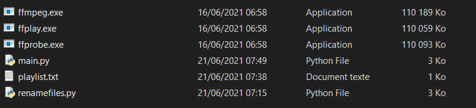

# YTBmusicDL
Python script using youtube-dl to automate mp3 downloading with relevant settings (metadata for titles, album, author ...)

# Disclaimer
This project was done for education purposes only. Please do not use it to download content you are not allowed to download.  
The author of this program is not responsible for how you use it.

# Features
- Download files as mp3 at the best quality available
- Add a title, album and the author in the files' metadata  
- Add an Album cover to the file (the thumbnail of the video) 
- Place all the files in a 'Music' directory  
- Delete previous 'Music' folder and the files it contains when starting the program (can be disabled by creating the folder manually and removing line 82 in main.py)
- History file that stores previously downloaded songs (can be disabled by removing line 92 in main.py). The script will not download these songs again (can be disabled by removing line 86).  

For videos with the title structure AUTHOR - TITLE (...). Can be disabled by removing line 97 in main.py
- If the title in the mp3 metadata contains this structure too, the script will remove the AUTHOR part and anything after the title such as (Official Video).
- If the video does not contain metadata in the description, i.e. does not contain this:

- The author on the mp3 file will be the channel name, which is not always the song authors' name. The script will change the author using the title.  

#### Example
Without filter:

With filter:


# Installation
Download main.py,renamefiles.py and playlist.txt and put them in the same folder.  

 Install youtube-dl and mutagen by typing in the cmd:
 ```sh
 pip install youtube-dl  
 pip install mutagen
```
 
 Download [ffmpeg](https://www.gyan.dev/ffmpeg/builds/), unzip it and open: ffmpeg(YOUR VERSION)/bin  
 Move ffmpeg, ffplay, ffprobe into the folder where you previously put main.py, renamefiles.py and playlist.txt  
 Your folder should look like this:  
 

# Use
Place youtube urls in the 'playlist.txt' document (1 url each line).  
Start the program by typing in the cmd:
``` sh
python main.py
```   

**Note:** the script will be correct on titles in the structure AUTHOR - TITLE, but not TITLE - AUTHOR (it will reverse them).

# Modification
[youtube-dl documentation](https://github.com/ytdl-org/youtube-dl/blob/master/README.md#developer-instructions)  
Please feel free to send me suggestions / ask questions, I would be happy to help if I can.
